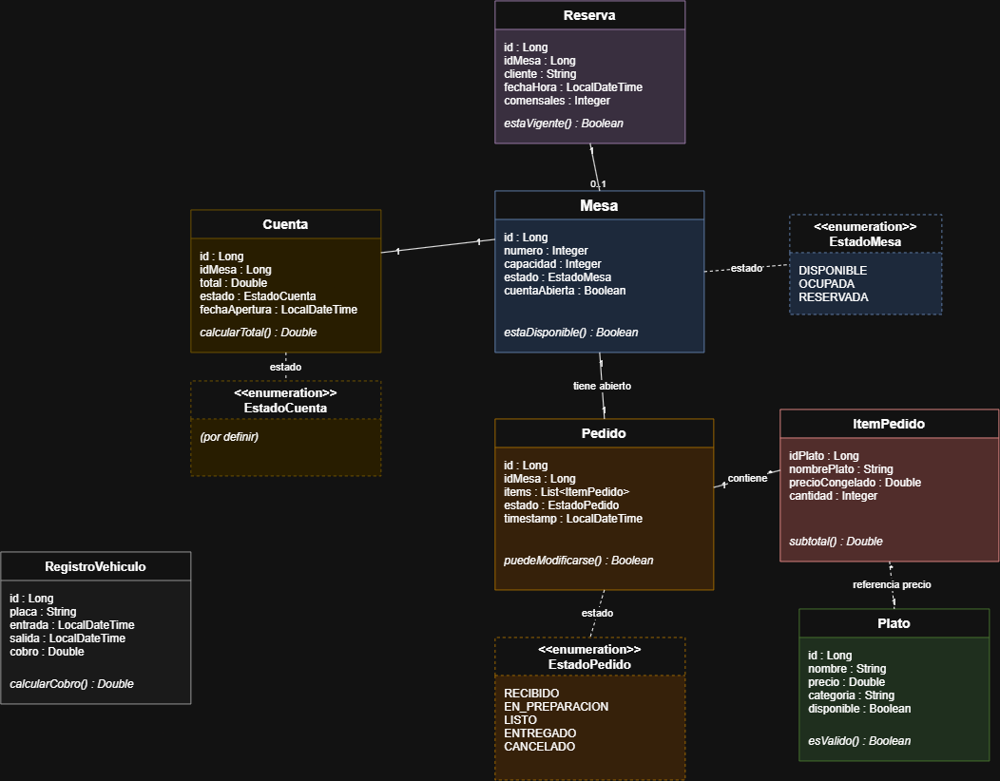
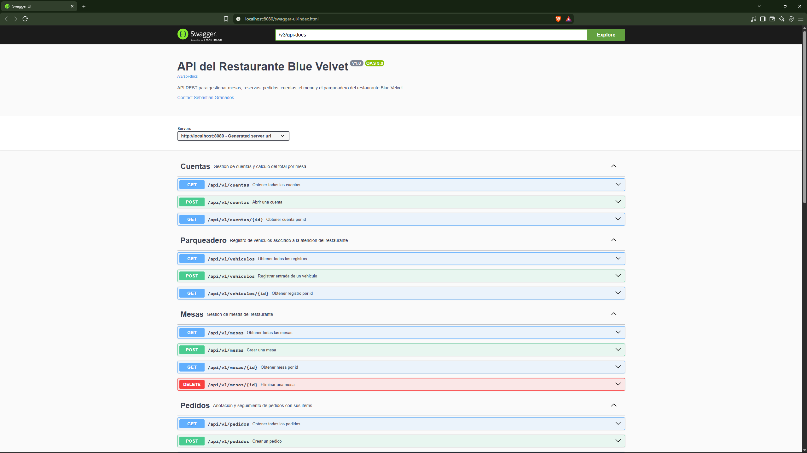
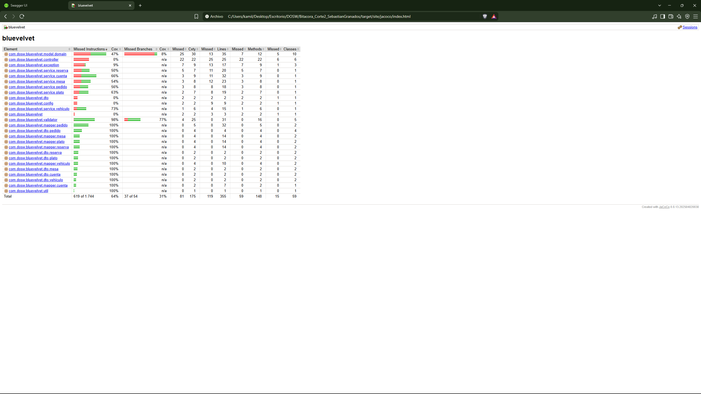
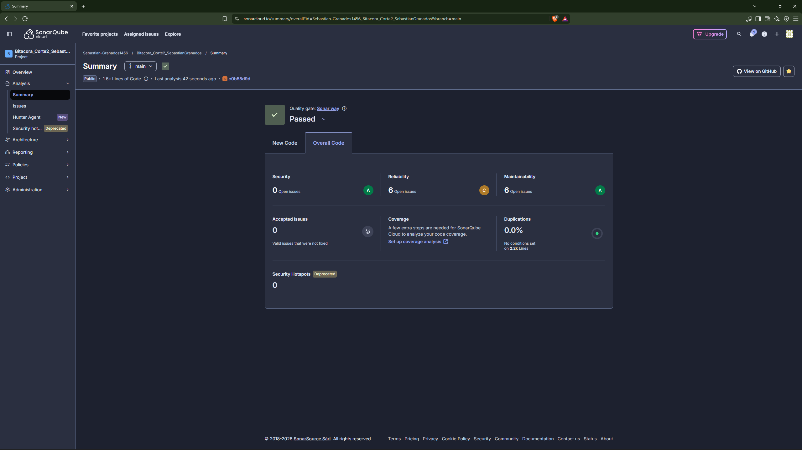
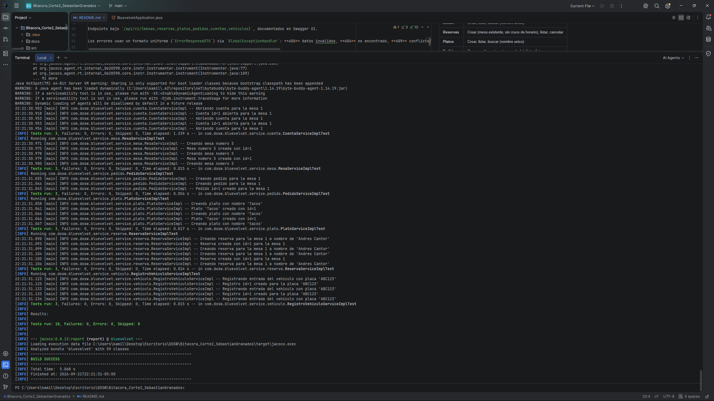

# Bitacora_Corte2_SebastianGranados

- Sebastian Granados

## Blue Velvet

Sistema de gestion para el restaurante **Blue Velvet**, desarrollado como bitacora de laboratorio del segundo corte de la asignatura DOSW. El proyecto permite administrar mesas, reservas, cuentas y pedidos del restaurante.

## Problema a resolver

Actualmente el restaurante gestiona las mesas, pedidos y cuentas de forma manual (en papel o a memoria), lo que genera errores en las ordenes, demoras en la atencion al cliente y dificultad para llevar un registro confiable del estado de cada mesa y su facturacion.

## Alcance del sistema

**Dentro del alcance:**

- Gestion de mesas y su disponibilidad.
- Gestion de reservas por mesa.
- Anotacion y seguimiento de pedidos con sus items.
- Gestion de cuentas y calculo del total por mesa.
- Registro de vehiculos (parqueadero) asociado a la atencion del restaurante.
- El ciclo de una mesa: Reserva/Ocupacion -> Pedido -> Preparacion -> Cuenta -> Cierre

**Fuera del alcance:**

- Domicilios.
- Programas de fidelizacion a clientes.
- Multi-sucursales.

## Diagramas



---

## Funcionalidades implementadas

API en memoria (sin persistencia) con arquitectura en capas (Controller -> Service -> Mapper/Validator -> Dominio), version inicial con las operaciones esenciales:

| Dominio | Funcionalidades |
|---|---|
| **Mesas** | Crear, listar, buscar (numero unico) |
| **Reservas** | Crear (mesa existente, sin cruce de horario), listar, cancelar |
| **Platos** | Crear, listar, buscar (nombre unico) |
| **Pedidos** | Crear con items (precio congelado), listar, listar por mesa |
| **Cuentas** | Abrir (1 por mesa) y consultar total calculado |
| **Vehiculos** | Registrar entrada (sin duplicar placa activa), listar |

Endpoints bajo `/api/v1/{mesas,reservas,platos,pedidos,cuentas,vehiculos}`, documentados en Swagger UI.

Los errores usan un formato uniforme (`ErrorResponseDTO`) via `GlobalExceptionHandler`: **400** datos invalidos, **404** no encontrado, **409** conflicto/duplicado, **500** error interno.

## Estructura del proyecto

```
src/main/java/com/dosw/bluevelvet/
├── controller/   Controllers REST (uno por dominio)
├── service/      Interfaces (I*Service) e implementaciones
├── dto/          Records de entrada/salida + ErrorResponseDTO
├── mapper/       Mappers In/Out (DTO <-> dominio)
├── validator/    Regla de negocio de cada dominio
├── model/domain/ Objetos de dominio
├── exception/    Excepciones + GlobalExceptionHandler
├── util/         Utilidades estaticas
└── config/       Configuracion de Swagger
```

## Ejecucion

```bash
mvn spring-boot:run
```

App en `http://localhost:8080`, Swagger en `http://localhost:8080/swagger-ui/index.html`.

## Pruebas

```bash
mvn test
```

18 pruebas (JUnit 5 + Mockito): por dominio, caso exitoso + conflicto/duplicado + no encontrado.

## Evidencias

**Swagger UI** — documentacion interactiva de todos los endpoints:



**Cobertura de pruebas (Jacoco)**:



**Analisis estatico (SonarCloud)** — Quality Gate: Passed:



**Ejecucion de pruebas** — `mvn test`:


